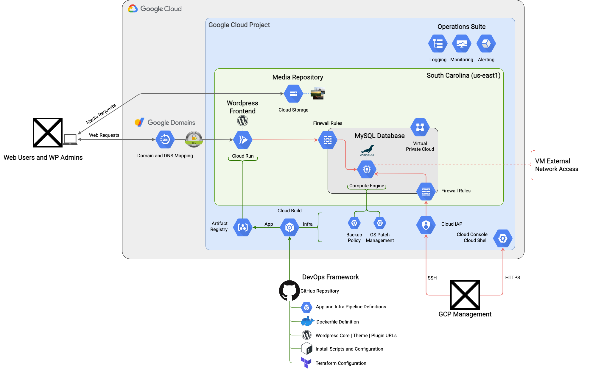

# Wordpress on GCP Free Tier
How to run a self-hosted Wordpress site almost entirely within the [free tier](https://cloud.google.com/free/docs/free-cloud-features#free-tier-usage-limits) of GCP services. Domain name not included.

## Table of Contents
- [Architecture](#architecture)
- [Overview](#overview)
- [New Installation](#new-installation)
- [Migrating from V1 → V2](#migrating-from-v1--v2)
- [Limitations and Future Considerations](#limitations-and-future-considerations)
- [Maintenance](#maintenance)
- [License](#license)

## Architecture

## Overview
The core software components are the Wordpress [LAMP stack](https://en.wikipedia.org/wiki/LAMP_(software_bundle)).

Compute, data, and media are separated and distributed, with the Wordpress frontend running in a [Cloud Run](https://cloud.google.com/run) service, the MariaDB database running on a [Compute Engine](https://cloud.google.com/compute) VM, and Wordpress media being stored in and served from a [Cloud Storage](https://cloud.google.com/storage) bucket.

The free tier monthly usage budgets of these services that this solution aims to stay within are:
- **Cloud Run**: 2m Requests / 360k GB Seconds / 180k vCPU Seconds / 1 GB Network Egress
- **Compute Engine**: 1 e2-micro Instance / 30 GB HDD Disk / 1 GB Network Egress
- **Cloud Storage**: 5 GB Standard Storage / 5k Class A Ops / 50k Class B Ops / 100 GB Network Egress

### Wordpress Frontend
The management of the Wordpress frontend follows modern DevOps principles. The Apache/PHP/Wordpress stack is built and deployed as an immutable Docker image, which then executes in Cloud Run in a stateless, serverless, scale-to-zero model. The CI/CD pipeline is fully automated from a build trigger on the GitHub repo, guaranteeing that the repo will always be the source of truth for the Wordpress frontend. Hand-rolled modifications to Wordpress files that are either unavoidable or desired can be injected into the [customizations.sh](wordpress-pipeline/customizations.sh) file, which is executed in the pipeline.

The biggest consideration in this model is the cold start, or the amount of pre-processing time required in a new container before it can process requests. Early testing showed that the suggested model of copying custom Wordpress themes/plugins into the source directory (/usr/src/wordpress) of the image so they can then be copied into the Apache directory (/var/www/html) along with the Wordpress core on container initialization was extremely inefficient, resulting in cold starts that were consistently taking over 15 seconds.

The cold start has been optimized by baking the part of the [Docker Entrypoint](https://github.com/docker-library/wordpress/blob/master/docker-entrypoint.sh) process that copies the Wordpress core and custom themes/plugins into the Apache directory into the image itself. The upstream Wordpress image declares the Apache directory as a volume, so the only way to achieve this is to ignore the Wordpress core that's inside the Docker image and copy in the same files from the repo during the build process. Docker allows copying external files into a volume, but not files that are inside the image. This adds some complexity, but reduces the cold start to about 2 seconds. It also plays within the logic of the Docker Entrypoint - this step will simply be skipped because the files already exist in the Apache directory.

### MariaDB Database
The approach to the MariaDB database follows a traditional hosting model, with it sitting on a long-running e2-micro instance. The e2-micro is Google Cloud's smallest VM instance class that is offered in the free tier, with 1 GB memory and 0.25 vCPU that can occasionally burst to 2 full cores.

MariaDB isn't prescriptive on resource requirements, because it will depend on the database size and transactional volume that need to be supported. Performance has been optimized by provisioning the largest persistent disk possible within the free tier (30 GB HDD) to maximize the IOPS budget, then allocating a 1 GB swap file to relieve memory pressure. The fractional CPU is still a bottleneck, but the whole platform stood up to quite a bit of [Apache Bench](https://httpd.apache.org/docs/2.4/programs/ab.html) load testing. For a site that will receive a modest amount of traffic, it's sufficient.

The install process configures weekly snapshots of the persistent disk with a 7 day retention policy, eliminating the need for a Wordpress plugin to perform site backups.

### Wordpress Media
Media storage and request processing is offloaded to Cloud Storage through the [WP Stateless](https://wordpress.org/plugins/wp-stateless/) plugin. This compliments the immutable nature of the Wordpress frontend (where media would be stored in a traditional hosting model), and instead leverages a Google-managed service that provides durability, performance, and unlimited capacity.

## New Installation
Head on over to the [Install Guide](INSTALL.md) for step by step instructions.

But please **do this first**:
- [Use the template](https://docs.github.com/en/repositories/creating-and-managing-repositories/creating-a-repository-from-a-template) to create your own private repo (private is strongly recommended, to safely store your site's terraform.tfvars file)
- Configure the [theme(s)](https://wordpress.org/themes/) that you intend to use on the site in the wordpress-themes folder
- Configure the [plugins](https://wordpress.org/plugins/) that you intend to use on the site in the wordpress-plugins folder
- Create a GCP project to install into with [billing enabled](https://cloud.google.com/billing/docs/how-to/modify-project), and ensure that your Google Account has the **Owner** IAM Role on this project
- Make a copy of the [terraform.tfvars.template](terraform/terraform.tfvars.template) file, name it **terraform.tfvars**, and update the variables with your planned configuration
- Add yourself to the CODEOWNERS file
- Commit the changes back into your private repo

The install process is highly automated and reasonably configurable, leveraging Terraform, shell scripts, and `gcloud` commands as much as possible. Going from an empty GCP project to a base Wordpress install can be accomplished in less than an hour.

## Migrating from V1 → V2
If you're using "Version 1" of this solution (not formally versioned, but characterized as without Terraform-managed infrastructure and with MySQL instead of MariaDB), check out the [Migration Guide](migration/MIGRATION.md) for assistance on deploying and migrating to the latest version that was released in September 2023.

## Limitations and Future Considerations
- There are no performance or availability guarantees. This runs in a single GCP region with a database that has minimal resources to draw from. Since it's immutable, server-side caching isn't possible. Given those constraints, it's surprisingly performant.
- This implementation could be improved by upgrading the Wordpress frontend to a multi-region [Serverless NEG](https://cloud.google.com/load-balancing/docs/negs/setting-up-serverless-negs) with Global HTTPS Load Balancing / CDN and moving the MySQL database into [Cloud SQL](https://cloud.google.com/sql/docs/mysql). It would deviate from the free tier objective, but would better align to production-grade cloud architecture practices.
- The MySQL VM has an external IP address to allow for package updates to be obtained from the internet without needing to implement a NAT/proxy solution, which would deviate from the free tier objective. All inbound connectivity from the public internet to the MySQL VM is denied.
- Multiple SDLC environments aren't supported out of the box.
- Test automation in the CI/CD pipeline and post-deployment verification (with alerting on failure) would be nice to have.
- Creation of a dashboard in the Cloud Operations Suite to measure and alert on usage of the free tier resources is an interesting idea that is yet to be explored.
- Targeted optimization of MySQL will likely be necessary to best support a more complex site with increasing traffic.

## Maintenance
- The [Terraform](https://developer.hashicorp.com/terraform/downloads) and [Google Provider](https://registry.terraform.io/providers/hashicorp/google/latest) versions should be kept reasonably current. A version upgrade involves updating the [versions.tf](terraform/versions.tf) file, and the pipelines that use a Terraform Google Cloud builder image (listed below). A Terraform plan/apply cycle needs to be performed, and the Wordpress site needs  to be deployed and validated.
  - [terraform-pipeline.yaml](terraform-pipeline.yaml)
  - [terraform-import.yaml](terraform-import.yaml)
  - [wordpress-pipeline.yaml](wordpress-pipeline.yaml)
- The MySQL VM needs to occasionally be patched. The OS Patch Management service is configured, but patch deployment jobs need to be manually configured and executed. Updates to MariaDB also need to be manually applied.
- Since the Wordpress frontend is immutable, updates to the Wordpress core, themes, and plugins are disabled and need to be performed through the CI/CD pipeline instead of the Wordpress Dashboard. This requires occasionally configuring the new zip file URLs, then triggering the app pipeline to deploy an updated container to the Cloud Run service.
- Updates to the Wordpress core require a change to the Dockerfile to pull the new upstream image (in addition to configuring the new zip file URL).

## License
GPL 3.0 - See [LICENSE](LICENSE) for more information.
