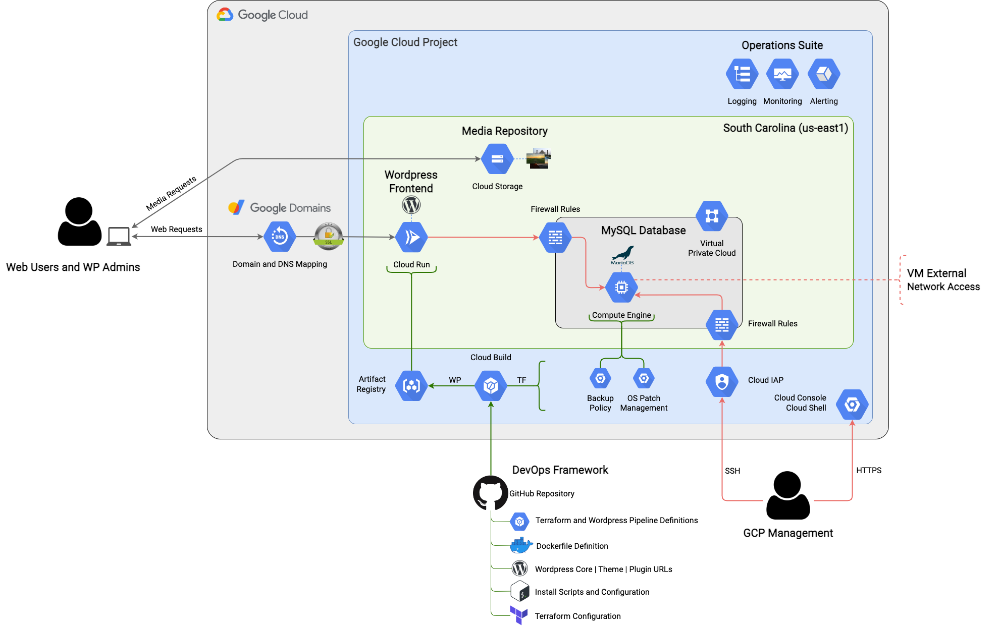

# Wordpress on GCP Free Tier
How to run a self-hosted Wordpress site almost entirely within the [free tier](https://cloud.google.com/free#always-free-products_1) of GCP services. Domain name not included.

## Table of Contents
- [Architecture](#architecture)
- [Overview](#overview)
- [Installation](#installation)
- [Limitations and Future Considerations](#limitations-and-future-considerations)
- [Maintenance](#maintenance)
- [License](#license)

## Architecture

## Overview
The core software components are the Wordpress [LAMP stack](https://en.wikipedia.org/wiki/LAMP_(software_bundle)).

Compute, data, and media are separated and distributed, with the Wordpress frontend running in a [Cloud Run](https://cloud.google.com/run) service, the MySQL database running on a [Compute Engine](https://cloud.google.com/compute) VM, and Wordpress media being stored on and served from a [Cloud Storage](https://cloud.google.com/storage) bucket.

The free tier monthly usage budgets of these services that this solution aims to stay within are:
- **Cloud Run**: 2m Requests / 360k GB Seconds / 180k vCPU Seconds / 1 GB Network Egress
- **Compute Engine**: 1 f1-micro Instance / 30 GB HDD Disk / 1 GB Network Egress / 5 GB Snapshot Storage
- **Cloud Storage**: 5 GB Standard Storage / 5k Class A Ops / 50k Class B Ops / 1 GB Network Egress

### Wordpress Frontend
The management of the Wordpress frontend follows modern DevOps principles. The Apache/PHP/Wordpress stack is built and deployed as an immutable Docker image, which then executes in Cloud Run in a stateless, serverless, scale-to-zero model. The CI/CD pipeline is fully automated from a build trigger on the GitHub repo, guaranteeing that the repo will always be the source of truth for the Wordpress frontend. Hand-rolled modifications to Wordpress files that are either unavoidable or desired can be injected into the [customizations.sh](install/pipeline/customizations.sh) file, which is executed in the pipeline.

The biggest consideration in this model is the cold start, or the amount of pre-processing time required in a new container before it can process requests. Early testing showed that the suggested model of copying custom Wordpress themes/plugins into the source directory (/usr/src/wordpress) of the image so they can then be copied into the Apache directory (/var/www/html) along with the Wordpress core on container initialization was extremely inefficient, resulting in cold starts that were consistently taking over 15 seconds.

The cold start has been optimized by baking the part of the [Docker Entrypoint](https://github.com/docker-library/wordpress/blob/master/docker-entrypoint.sh) process that copies the Wordpress core and custom themes/plugins into the Apache directory into the image itself. The upstream Wordpress image declares the Apache directory as a volume, so the only way to achieve this is to ignore the Wordpress core that's inside the Docker image and copy in the same files from the repo during the build process. Docker allows copying external files into a volume, but not files that are inside the image. This adds some complexity, but reduces the cold start to about 2 seconds. It also plays within the logic of the Docker Entrypoint - this step will simply be skipped because the files already exist in the Apache directory.

### MySQL Database
The approach to the MySQL database follows a traditional hosting model, with it sitting on a long-running f1-micro instance. The f1-micro is Google Cloud's smallest VM instance class that is offered in the free tier, with 0.6 GB memory and 0.2 vCPU that can occasionally burst to a full core.

MySQL isn't prescriptive on resource requirements, because it will depend on the database size and transactional volume that need to be supported. Performance has been optimized by provisioning the largest persistent disk possible within the free tier (30 GB HDD) to maximize the IOPS budget, then allocating a 1 GB swap file to relieve memory pressure. The fractional CPU is still a bottleneck, but the whole platform stood up to quite a bit of [Apache Bench](https://httpd.apache.org/docs/2.4/programs/ab.html) load testing. For a site that will receive a modest amount of traffic, it's sufficient.

The install process configures daily snapshots of the persistent disk with a 3 day retention policy, eliminating the need for a Wordpress plugin to perform site backups.

### Wordpress Media
Media storage and request processing is offloaded to Cloud Storage through the [WP Stateless](https://wordpress.org/plugins/wp-stateless/) plugin. This compliments the immutable nature of the Wordpress frontend (where media would be stored in a traditional hosting model), and instead leverages a Google-managed service that provides durability, performance, and unlimited capacity.

## Installation
Head on over to the [Install Guide](INSTALL.md) for step by step instructions.

But please **do this first**:
- [Mirror](https://docs.github.com/en/github/creating-cloning-and-archiving-repositories/duplicating-a-repository) the public origin repo into your own private repo (private is strongly recommended, to safely store your site's variables.conf file)
- Download the [theme(s)](https://wordpress.org/themes/) that you intend to use on the site into the wordpress-themes folder
- Download the [plugins](https://wordpress.org/plugins/) that you intend to use on the site into the wordpress-plugins folder
- Create a GCP project to install into, and ensure that your Google Account has the **Owner** IAM Role
- Update the [variables.conf](install/variables.conf) file with your planned configuration
- Commit the changes back into your private repo

The install process is highly automated and reasonably configurable, leveraging shell scripts and `gcloud` commands as much as possible. Going from an empty GCP project to a base Wordpress install can be accomplished in less than an hour.

## Limitations and Future Considerations
- Database connectivity between Cloud Run and the MySQL VM is hairpinned through the Google Frontend to an external IP. This is an architecture decision that favors cost over security. It introduces both a performance consideration and an attack surface. The performance impact is negligable. The attack surface risk has been mitigated as much as possible by hardening the MySQL install and creating a firewall rule that only allows ingress on tcp port 3306 to the MySQL VM. A bad actor would need to know the external IP of the MySQL VM and database credentials to gain access. Storing site-specific configuration in a private repo and using a very strong Wordpress username and password for the database will minimize the risk of this happening. That said, an attack surface still exists, and I'm evaluating the possibility of restricting the firewall rule source IP addresses to Google's netblocks for Cloud Run, but that information is difficult to obtain in a deterministic manner.
- There are no performance or availability guarantees. This runs in a single GCP region with a database that has minimal resources to draw from. Since it's immutable, server-side caching isn't possible. Given those constraints, it's surprisingly performant. The weak link is the database server.
- This implementation could be dramatically improved by upgrading the Wordpress frontend to a multi-region [Serverless NEG](https://cloud.google.com/load-balancing/docs/negs/setting-up-serverless-negs) with Global HTTPS Load Balancing / CDN, moving the MySQL database into [Cloud SQL](https://cloud.google.com/sql/docs/mysql), and providing internal-only connectivity between the Wordpress frontend and the MySQL database through [Serverless VPC Access](https://cloud.google.com/vpc/docs/configure-serverless-vpc-access). It would deviate from the free tier objective, but would better align to production-grade cloud architecture practices.
- Multiple SDLC environments aren't supported out of the box. Monorepo principles are followed, with the exclusion of the Wordpress dependencies.

## Maintenance
- The Container Registry image history needs to be maintained, since it's charged as Cloud Storage consumption. This is purely a cost management motion.
- The MySQL VM needs to occasionally be patched. The OS Patch Management service is configured, but patch deployment jobs need to be configured and executed.
- Since the Wordpress frontend is immutable, updates to the Wordpress core, themes, and plugins are performed through the CI/CD pipeline instead of the Wordpress Dashboard. This will require occasionally downloading the respective zip files, swapping them in for the old versions in the repo, then triggering the pipeline to deploy an updated container to the Cloud Run service - a task that could probably be automated in the pipeline with [WP-CLI](https://wp-cli.org/).
- Updates to the Wordpress core also require a change to the Dockerfile to pull the new upstream image.

## License
GPL 3.0 - See [LICENSE](LICENSE) for more information.
